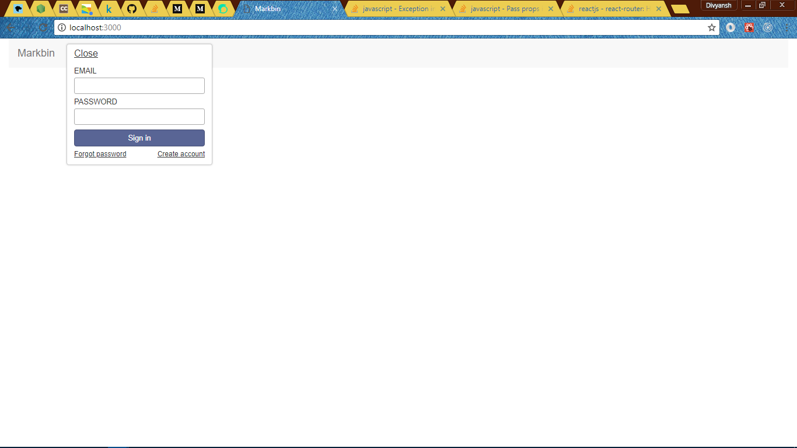
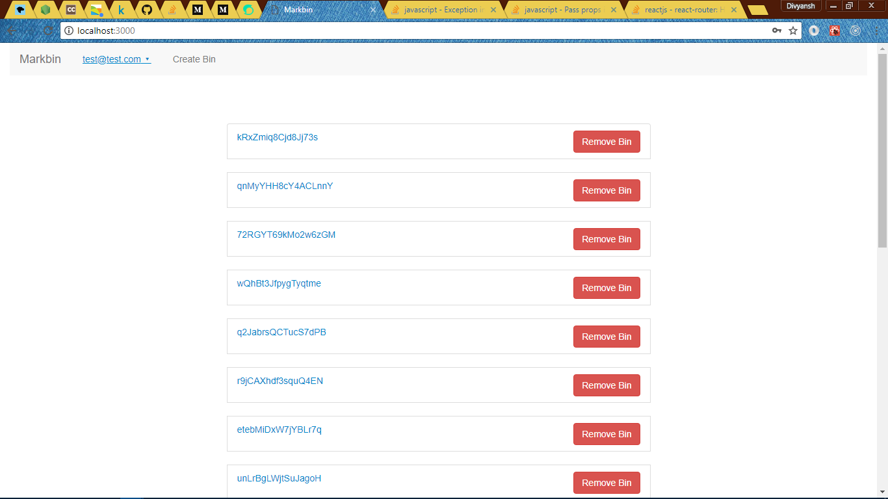
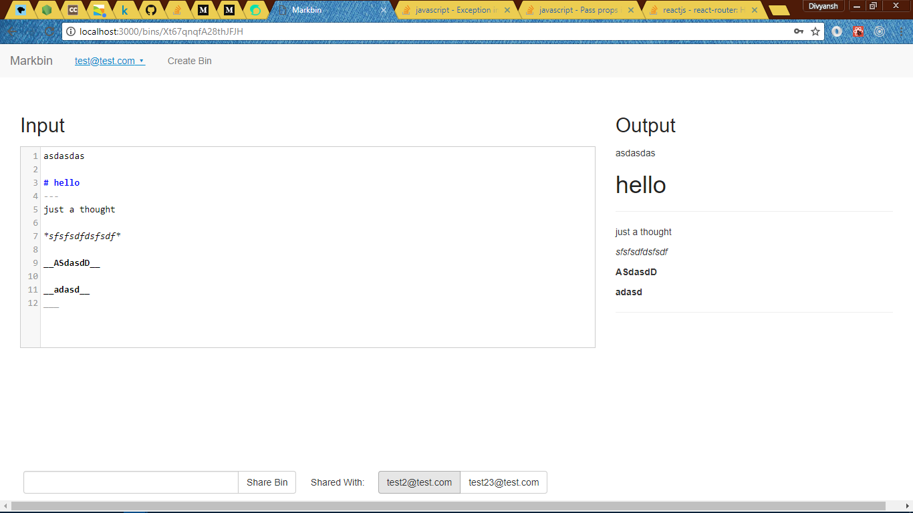
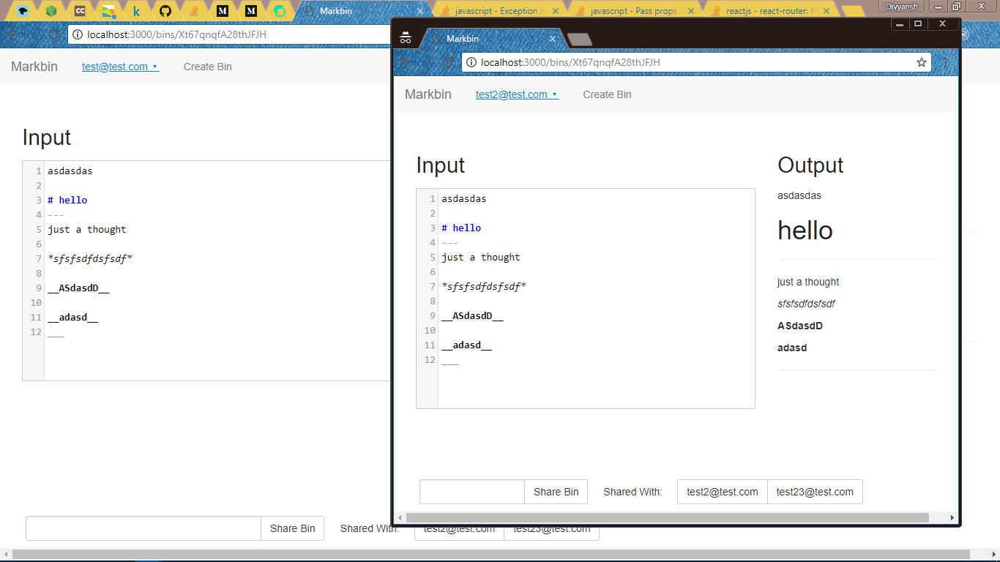

# MarkBin

A real time markdown editor and a workspace to share your work with other people with real time commits.

## Getting Started
```
* Clone the repo.
* run npm install
* run meteor
```

### Prerequisites

What things you need to install the software and how to install them

```
* NODEJS
* Meteor
* React
```

## Built With

* [NODEJS](https://www.nodejs.org) - The web framework used
* [Meteor](https://www.meteor.com) - BackEnd framework.
* [React](https://www.reactjs.org) - FrontEnd framework

## Contributing

Please contribute any ideas or code as to make this app a better one.


## Authors

* **Divyansh Dwivedi** - *Initial work*

See also the list of [contributors](https://github.com/your/project/contributors) who participated in this project.

## License

This project is currently unlicensed.

## Screenshot





